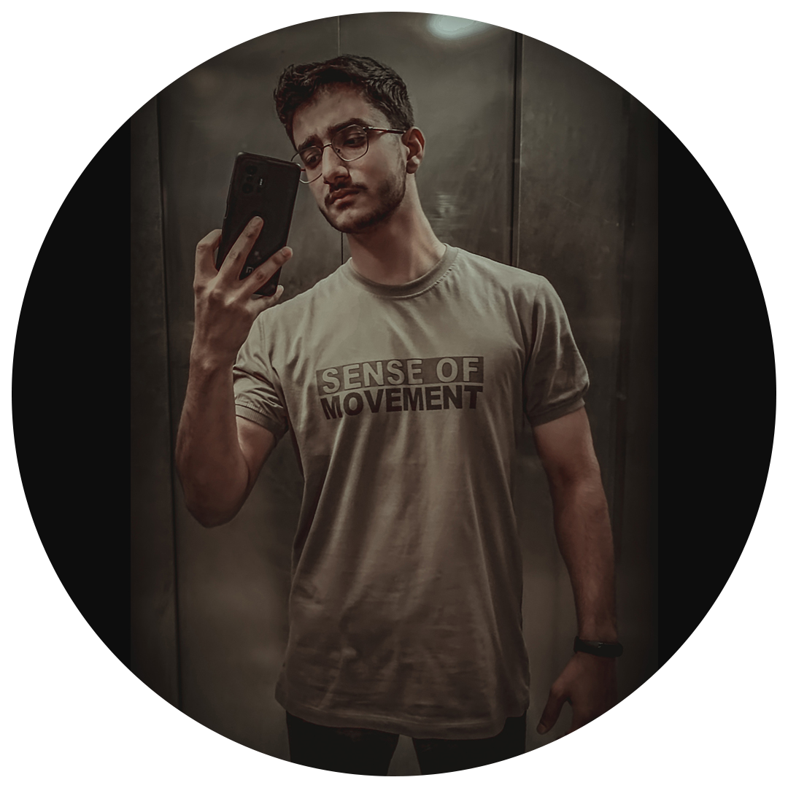

  

  <h1>Mostafa Gholami</h1>

   

  <h2>About me</h2>
  
a front-end developer specializing in React and Tailwind frameworks. I am proficient in Python and have experience in developing Telegram bots. Additionally, I have over 5 years of experience in graphic design with full mastery of Photoshop and Illustrator.    

  <h2 align="left">Socials</h2>
    
    

  <h2>My Expertise</h2>

  
  
  
  
  
  
  
  
  
  

  
  
  
  
  
  
  
  
  

    

  <h2>GitHub Stats</h2>
  

